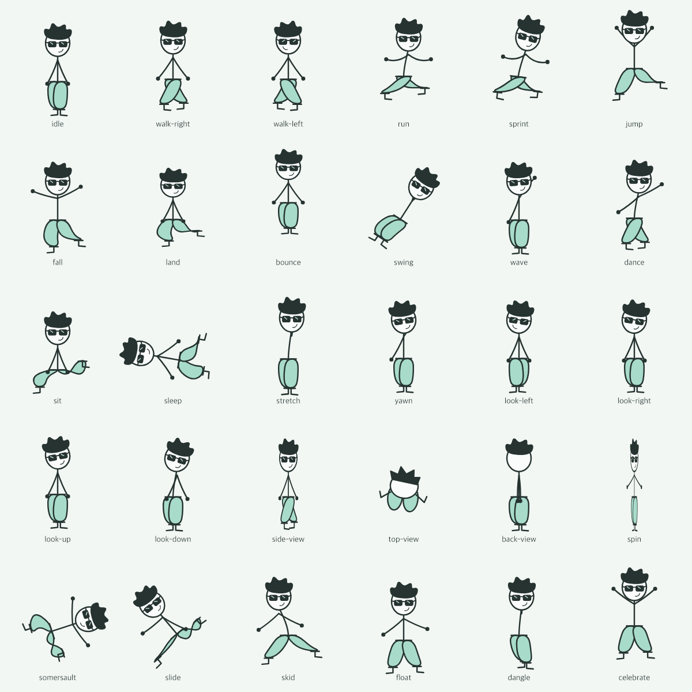

# Milo

A little desktop stickman with sunglasses, soft mint baggy trousers and messy hair. An original companion inspired by the momentum and expressive movement of Fancy Pants Adventures. No game assets or game code are included.



## Download

Get a build from this repository's **Releases** page. The first local build targets Apple Silicon Macs. Unzip Milo and drag it to Applications, then open it. The macOS build is ad-hoc signed, not Apple-notarized; macOS may require approval in Privacy & Security. Windows and Linux builds are produced by the release workflow and are unverified until tested on those systems.

Open the studio and press **Let him roam**. Milo appears in a transparent always-on-top window. Drag him to toss, double click to hop, or right click for his menu. Use the menu-bar tray to pause, return to the studio, move him to the current display, or quit. There is no auto-start, account, analytics, network service or screen reading. Ordinary windows are not collision geometry: he lives within the current display's work area. Secure system surfaces may appear above him.

## Physics

- Fixed 120 Hz root motion, gravity, restitution, floor friction and damped pendulum motion.
- Upright pose-controlled skeleton with a spring-damped flexible spine, curved arms, and articulated legs. This is an active character, not a passive ragdoll.
- Two 7 × 5 cloth meshes with structural, diagonal shear and bend-distance constraints, pinned waist/cuffs, a leg fitting envelope, four substeps and eight XPBD solver iterations per step.
- Four independent five-point hair locks, constrained roots, compliant bend distances, damping and shape recovery.
- Garments and hair react to acceleration and gravity. Clothes remain attached to the animated skeleton.
- Smooth antialiased Canvas vector rendering at display pixel density; no low-poly 3D mesh.

This is a stylized two-dimensional approximation. It does not simulate calibrated textile material properties, volumetric fabric, full cloth self-collision, aerodynamic fluid flow, or a biomechanical balance controller. Animation-driven limb movement is mixed with physical secondary motion. It is not photorealistic or a complete real-world physics model.

## Sprites and rig

`assets/sprites/` contains **30 transparent PNG sheets**, each **2048 × 768**, 8 columns × 3 rows of 256-pixel cells. Each has 24 frames at 24 fps. `manifest.json` records timing and loop flags. Exported sprites bake one deterministic motion sample; the app renders the live rig so it can react to new forces.

`src/rig.js`: editable poses and vector appearance. `src/softbody.js`: cloth/hair constraints. `src/physics.js`: root body and pendulum. The side/top/back poses are stylized 2D views, not a full 3D model.

## Development

Requires Node.js 22+ and npm.

```sh
npm ci
npm start          # desktop studio
npm run preview   # local browser studio
npm test
npm run sprites   # regenerate all sheets
npm run pack      # Apple Silicon zip + dmg
```

Studio controls change gravity, restitution, size and autonomous behavior. Quiet motion disables secondary motion and wandering; pause freezes the scene. Space hops and left/right arrows push Milo when the studio canvas is focused.

## Research

- [Fancy Pants 2 on Poki](https://poki.com/en/g/fancy-pants-2) identifies the likely user reference. The gaming site was blocked on the development device; no bypass was attempted and gameplay was not directly tested.
- [Borne Games: original FPA](https://www.bornegames.com/games/fpa-world-1/original/) describes momentum-based platforming.
- [Brad Borne developer interview](https://www.gamedeveloper.com/design/a-fast-and-fancy-dev-q-a-with-brad-borne) describes the tightly hand-tuned relationship between animation and movement.
- [Macklin, Müller and Chentanez: XPBD (2016)](https://matthias-research.github.io/pages/publications/XPBD.pdf) supplies the compliant constraint formulation used here. Our small 2D solver is independently implemented.

## License

MIT. Milo's original character art and source are included under the same license. Fancy Pants Adventures belongs to its respective creators and is only a movement reference.
